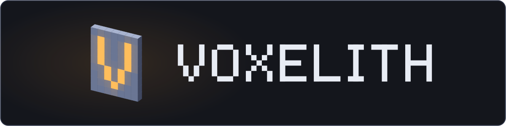
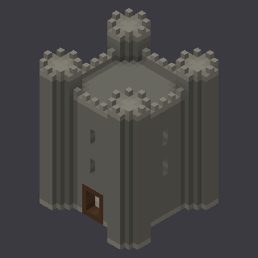
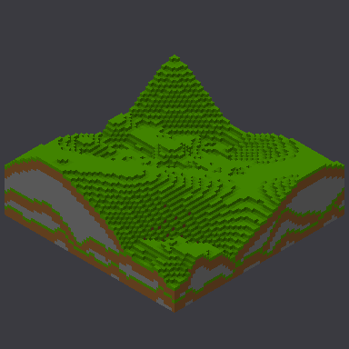
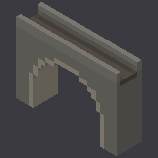

<div align="center">



**Procedural-first Voxel Asset Creation Tool**

[](https://www.rust-lang.org/)
[](https://wgpu.rs/)
[](LICENSE)

[中文文档](README_CN.md)

<br>

  

<sub>Straight out of the tool: models built by an agent over the ops protocol, drawn by <code>voxelith render</code>, graded by <code>voxelith eval</code>.</sub>

</div>

---

## Overview

**Voxelith** is a modern voxel editor built with Rust, featuring GPU-accelerated rendering via wgpu and a clean egui interface. Designed as a procedural-first tool for both manual editing and programmatic generation.

## Features

| Feature | Description |
|---------|-------------|
| 🎨 **Editing** | 5 brush tools (Place / Remove / Paint / Eyedropper / Fill) + 4 shape tools (Line / Box / Sphere / Cylinder) with click-anchor / drag / release. Drag-paint with stroke-merged undo, brush hover preview, X / Y / Z symmetry mirroring |
| ▭ **Box select** | `0` to enter Select. Drag corners to mark an AABB; drag inside to move (single undoable Command, overlap-safe); arrow keys nudge X / Z, `Ctrl+↑↓` Y, `Shift` × 10. Rotate with `R` / `Shift+R`, mirror with `M` — each one undoable step. `Ctrl+C/X/V`, `Ctrl+Shift+V` paste-at-cursor, `Del`, `Ctrl+A` select-all-solid, `Esc` / `Ctrl+D` deselect. Paste auto-selects the destination AABB so Paste→drag→Paste chains |
| ⚓ **Sockets** | Drop named attachment points on any voxel face (position + outward normal). They persist in the project and export as glTF empty nodes — weapon mounts, FX anchors, banner slots for the engine to hang parts on |
| 📥 **Mesh import** | Voxelize a `.glb` into the scene at 32³ / 64³ / 128³ — surface sampling plus a parity-scan interior fill, with colors taken from the material's factor and base-color texture. Adds to what's already there as one undoable edit, so Ctrl+Z takes it back |
| 🔌 **Agent bridge** | The editor hosts an MCP server, so an agent edits the project you have open — its batches land on *your* undo stack, one Ctrl+Z per batch, and you can take over mid-build. It can hand you a node graph rather than raw voxels, so the result stays parametric. Or have it ask first: the batch appears as translucent geometry to apply or discard. Headless variants (a CLI and a standalone server) for when nobody's watching |
| 🏷️ **Game-asset materials** | Per-brush emissive / metallic flags plus a 4-slot faction **tint zone**, carried through to GLB as glTF materials and a per-vertex `_TINTZONE` attribute for a recolor shader downstream |
| 🌱 **Procedural generation** | Perlin terrain, L-system trees, WFC tilesets (Dungeon + City) — pick one in the procgen panel or compose with Translate / Filter / Mask / Combine nodes in the visual graph editor. The graph is saved with the project, and an agent can write one for you to keep tuning |
| ✨ **Live preview** | Debounced translucent overlay shows generator output before you commit |
| 📁 **File I/O** | Native `.vxlt` (gzip + state), MagicaVoxel `.vox` import (v150 + v200 multi-model + scene graph) / export (v150), Wavefront `.obj` and glTF Binary `.glb` export. OBJ / GLB also have Marching Cubes "smoothed" variants (light: rounded cubes / heavy: clay-like) for organic exports |
| 💾 **Persistent state** | Window layout, panel toggles, generator params, recent files all survive restarts |
| 🖥️ **Viewport** | Orbit / pan / zoom camera (with auto-resync on every orbit), grid, axes, optional wireframe |
| 💡 **Per-vertex AO** | Minecraft-style ambient occlusion baked into the greedy mesh — corners and crevices darken, open faces stay bright. Adds visible block-by-block depth without runtime cost |

## Quick Start

```bash
git clone https://github.com/Lynthar/Voxelith.git
cd Voxelith
cargo run --release

# Headless batch export: every .vxlt named in the spec → .glb,
# with per-asset pivot / up-axis / scale. No window, no GPU.
cargo run --release -- bake assets/spec.json

# Drive the modeling primitives from a shell (or an AI agent) with a
# JSON edit protocol: apply a batch, read the report, look at a slice.
cargo run --release -- exec ops.json --out hut.vxlt --describe
cargo run --release -- inspect hut.vxlt --slice '{"axis":"y","index":1}'
cargo run --release -- render hut.vxlt --view all   # see it: CPU raycast PNGs, no GPU
cargo run --release -- generators        # what `generate` can call

# Or serve the same primitives over the Model Context Protocol, holding
# one document open across calls (stdio; --http needs `mcp-http`).
# With --checkpoint every edit is written back to the project file, and
# the editor reloads it — keep the .vxlt open to watch the agent work.
cargo run --release -- mcp --root ./models --checkpoint

# Or skip the file entirely: the editor hosts a server of its own, so an
# agent edits the project you have open, on your undo stack. Point a
# client at the URL it prints (loopback only).
cargo run --release -- --agent-port 8737
```

Every subcommand above is headless; `--agent-port` is the editor itself.
`cargo build --no-default-features` builds that headless half — library
plus CLI, with no winit / wgpu / egui in the dependency tree — for a
container or CI runner that has no GPU. Add `--features mcp` to keep the
`mcp` subcommand in it: that one travels with its own feature, and a
plain `--no-default-features` build doesn't have it.
Run `voxelith exec --help` for the flags and `voxelith generators` for
the generator catalog; the ops schema itself is documented on the types
in `src/agent_ops/schema.rs`. If you are pointing an agent at this repo,
`.claude/skills/voxelith-modeling/` is the guide it should read — which
of the three paths to drive, the whole op vocabulary, and the modeling
technique that keeps a first attempt from being wrong.

## Keyboard Shortcuts

| Key | Action | Key | Action |
|-----|--------|-----|--------|
| `1-5` | Brush tools | `Ctrl+Z` | Undo |
| `6-9` | Shape tools | `Ctrl+Y` / `Ctrl+Shift+Z` | Redo |
| `0` | Box select | `Ctrl+C/X/V` | Copy / Cut / Paste |
| `WASD` | Move camera | `Ctrl+Shift+V` | Paste at cursor |
| `Q` / `E` | Camera up / down | `Del` | Delete selection |
| `Middle Mouse` | Orbit | `Ctrl+A` | Select all solid |
| `Right Mouse` | Pan | `Esc / Ctrl+D` | Deselect |
| `Scroll` | Zoom | `Arrows / Ctrl+↑↓` | Nudge selection |
| `F` | Frame selection (or whole scene) | `R` / `Shift+R` | Rotate selection ±90° about Y |
| `Ctrl+S/O/N` | Save / Open / New | `M` | Mirror selection across X |
| `Ctrl+Shift+S` | Save As | `Alt` (hold) | Eyedropper |

## Tech Stack

- 🦀 **Rust** - Systems language
- 🎮 **wgpu** - GPU rendering
- 🖼️ **egui** - Immediate mode UI
- 🗜️ **flate2** - Compression

## Architecture

```
┌──────────────────────────────────────────────┐
│ UI (egui panels + visual node graph editor) │
├──────────────────────────────────────────────┤
│ Editor (tools, commands, raycast, undo)     │
├──────────────────────────────────────────────┤
│ Procgen (terrain / tree / WFC + DAG eval)   │
├──────────────────────────────────────────────┤
│ Core (voxel, chunk, world) │ Mesh           │
│ Render (wgpu)              │ IO    Prefs    │
└──────────────────────────────────────────────┘
```

See [`docs/STATUS.md`](docs/STATUS.md) for current implementation state, the remaining roadmap, and design invariants.

## License

Apache License 2.0 © 2024-2026 Lynthar
