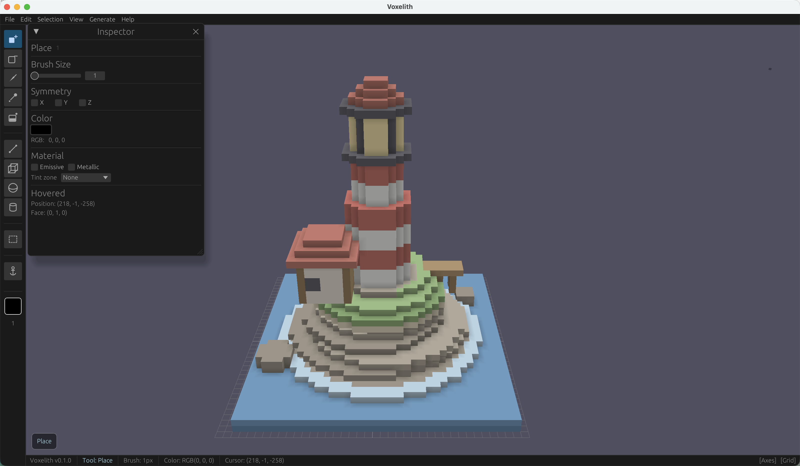

<div align="center">


[](LICENSE)
[](https://github.com/Lynthar/Voxelith/actions/workflows/ci.yml)
[](https://github.com/Lynthar/Voxelith/actions/workflows/audit.yml)

</div>

程序化优先的体素资产创作工具：wgpu/egui 编辑器，外加 agent 可驱动的无头 CLI 与 MCP 服务器

[English](README.md) | 简体中文

一个带 GPU 视口的体素编辑器，以及同一套代码的无窗口版本。不带子命令运行就是编辑器；
带上子命令，它可以批量烘焙成 glTF、执行一批 JSON 操作、用 CPU 渲出六视图 PNG，
或者拿一组断言给成品打分。

无头模式是我为一件具体的事做的：**让 agent 自己搭、再自己验**。所以操作词汇、
MCP 服务器和 eval 套件是从一开始就设计进去的，不是事后补的导出功能。



<sub>编辑器——wgpu 视口、egui 面板。这座灯塔是一批操作：48 个 op 经
<code>voxelith exec</code> 执行出来，再在这里打开。</sub>


<sub>同一个文件交给 <code>voxelith render</code>，它在 CPU 上画，全程不碰 GPU。
发光体素不参与明暗计算，所以灯室在这里亮着，而在视口里不会。</sub>

## 安装

**目前没有预编译二进制**，只能从源码构建，需要 Rust 1.88 以上。

```bash
git clone https://github.com/Lynthar/Voxelith.git
cd Voxelith
cargo run --release
```

只要无头模式、不想引入窗口和 GPU 依赖：

```bash
cargo build --release --no-default-features
cargo build --release --no-default-features --features mcp
```

macOS 上想让 Dock 里显示正确图标，需要打成 app bundle——winit 在 macOS 上没法给裸
`cargo run` 设窗口图标：

```bash
packaging/macos/bundle.sh
```

CI 覆盖 Windows 与 macOS，Linux 不在矩阵里。

## 用法

编辑器有五种笔刷——放置、擦除、上色、取色、填充——四种形状、框选，以及三个生成器
（Perlin 地形、L 系统树、wave function collapse），生成器参数存在工程的 pipeline graph 里。

```bash
voxelith                                   # 编辑器
voxelith --agent-port 8737                 # 编辑器 + 回环 MCP 桥
```

七个子命令不开窗口：

```bash
voxelith bake spec.json --shard 0/4
voxelith exec ops.json --in in.vxlt --out hut.vxlt --export hut.glb --dry-run
voxelith render hut.vxlt --view all --size 512 --out hut.png
voxelith inspect hut.vxlt --slice '{"axis":"y","index":1}'
voxelith eval evals/cases --results run-2026-08-08/
voxelith generators
voxelith mcp --root ./models --http 127.0.0.1:8080 --token …
```

`exec` 接十四种操作——方块、球、圆柱、直线、掏空、选择、镜像、生成器图——同一套词汇
通过 MCP 暴露成十一个工具。编辑器自己托管这个服务时，agent 的改动会进你的撤销栈，
你能一边看一边改。`docs/reference/bake-spec.example.json` 是一份能直接改的 bake spec；
`evals/` 下是 eval 用例，每个都是「任务描述 + 结果必须满足的性质」。

MCP 桥绑在回环地址并要求 token（`VOXELITH_MCP_TOKEN`，不给就启动时现生成并打印）；
`mcp --http` 会开端口，那个 token 请当成本地 API 凭据来对待。

## 能力边界

- **还没有发过版**——没有 tag、没有二进制、不在 crates.io 上。
- **没有图层、没有多对象、没有场景树。** 只有一个 world，做复杂资产时没法把部件分开。
  MagicaVoxel、[Goxel](https://github.com/guillaumechereau/goxel) 和
  [vengi](https://github.com/vengi-voxel/vengi) 都有这些；Voxelith 多的是无头模式，
  而且它读 `.vox` 的两个版本，模型可以在这些工具与 Voxelith 之间来回。
- **`.vox` 导出只写 150 版。** 读的时候 150 和 200 都收，但 200 版的场景图进来会被压平。
- **Linux 没有任何自动化覆盖。** GUI 在 Linux 上能不能编过、能不能跑起来，都没有验证过。
- **eval 判的是「装配得对不对」，不判「像不像」。** 它检查连通块、封闭性和尺寸；
  像不像，要你自己看。
- **同一时刻只允许一个写者。** 同一份文件的并发修改会被检出并拒绝，不做合并。

## 许可证

Mozilla 公共许可证 2.0 —— 见 [LICENSE](LICENSE)。Copyright (c) 2026 Lynthar。

本源代码形式受 Mozilla Public License 2.0 条款约束。若本文件未随附该许可证副本，
可从 <https://mozilla.org/MPL/2.0/> 获取。
